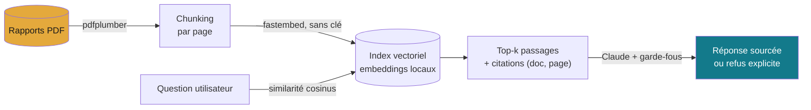

# Projet 05 — Assistant d'analyse financière (RAG / LLM)

> **« Quel était le résultat net en 2023 ? »** — pose la question en langage
> naturel, l'assistant répond **avec ses sources** (fichier + page) et **refuse
> d'inventer** quand l'information n'est pas dans les documents. C'est la pièce
> maîtresse du portfolio : un système RAG (Retrieval-Augmented Generation) dont
> les garde-fous anti-hallucination sont **mesurés**, pas seulement affirmés.

## 🧠 Le problème

Un LLM seul hallucine des chiffres plausibles mais faux — inacceptable en
finance. La réponse : ne jamais laisser le modèle répondre de mémoire. On
**récupère** d'abord les passages pertinents des rapports, puis on demande à
Claude de répondre **uniquement** à partir de ces extraits, en citant ses
sources, et de dire « je ne sais pas » sinon.

## ⚙️ Méthode (pipeline RAG)



- **Récupération** : `fastembed` (embeddings locaux, aucune clé) + cosinus NumPy.
  Fonctionne hors-ligne.
- **Génération** : Claude (`claude-sonnet-5`) via l'API Anthropic, avec un prompt
  système strict. Nécessite `ANTHROPIC_API_KEY`.
- **Garde-fous** : ancrage sur les sources, citation obligatoire, refus explicite,
  pas de calcul hors-sol — détaillés dans [docs/anti-hallucination.md](docs/anti-hallucination.md).

## 📊 Résultats (mesurés)

Évaluation contre une **vérité terrain connue** (`data/eval.json`) :

| Métrique | Résultat |
|---|---|
| **Rappel de récupération** (le bon chiffre est-il dans les k passages ?) | **7/7 = 100 %** (k=4) |
| **Refus correct** sur les questions hors-documents | garde-fou testé dans `evaluate.py` |

Les rapports sont **synthétiques mais réalistes** (générés par
`generate_reports.py`) : c'est précisément ce qui permet une évaluation
rigoureuse avec une vérité terrain maîtrisée. Le pipeline tourne **à l'identique**
sur de vrais PDF publics qu'on déposerait dans `data/`.

## 🚀 Reproduire

```bash
pip install -r requirements.txt

# 1. Générer les 2 rapports PDF (ACME 2023 & 2024)
python src/generate_reports.py

# 2. Construire l'index vectoriel (embeddings locaux, sans clé)
python -c "import sys; sys.path.insert(0,'src'); import rag; print(rag.build_index(), 'passages')"

# 3. Évaluer (récupération sans clé ; réponses si ANTHROPIC_API_KEY définie)
python src/evaluate.py

# 4. Interface web
export ANTHROPIC_API_KEY=sk-...      # PowerShell : $env:ANTHROPIC_API_KEY="sk-..."
streamlit run src/app.py
```

## 📁 Contenu

```
projet-05-assistant-analyse-financiere-rag/
├── src/
│   ├── generate_reports.py   ← génère 2 PDF financiers réalistes (reportlab)
│   ├── rag.py                ← cœur : ingestion, chunking, embeddings, retrieve, generate
│   ├── evaluate.py           ← évaluation vs vérité terrain (rappel + garde-fous)
│   └── app.py                ← interface Streamlit (Petrol & Ambre)
├── data/
│   ├── ACME_rapport_annuel_2023.pdf / _2024.pdf
│   └── eval.json             ← jeu de test Q/R (vérité terrain)
└── docs/anti-hallucination.md
```

Compétences : **RAG** (chunking, embeddings, recherche vectorielle) · intégration
**LLM** (Claude API, prompt engineering) · **garde-fous anti-hallucination
mesurés** · évaluation rigoureuse · Streamlit.

## 🔐 Sécurité

Aucune clé en dur : `ANTHROPIC_API_KEY` lue depuis l'environnement. L'index
vectoriel régénérable n'est pas versionné (voir `.gitignore`).

---

*Projet 05 du [Portfolio Data](../) — la brique IA/LLM. Réutilise l'identité
« Petrol & Ambre » du portfolio. Clôt la roadmap des 12 projets.*
